# ApnaResume - Data Flow Diagrams

## Table of Contents
1. [System Overview](#1-system-overview)
2. [User Authentication Flow](#2-user-authentication-flow)
3. [Resume Creation Flow](#3-resume-creation-flow)
4. [Resume Editing Flow](#4-resume-editing-flow)
5. [AI Content Generation Flow](#5-ai-content-generation-flow)
6. [Resume View & Export Flow](#6-resume-view--export-flow)
7. [Resume Deletion Flow](#7-resume-deletion-flow)
8. [Data Layer Architecture](#8-data-layer-architecture)
9. [Component Data Flow](#9-component-data-flow)
10. [State Management Flow](#10-state-management-flow)

---

## 1. System Overview

### High-Level System Data Flow

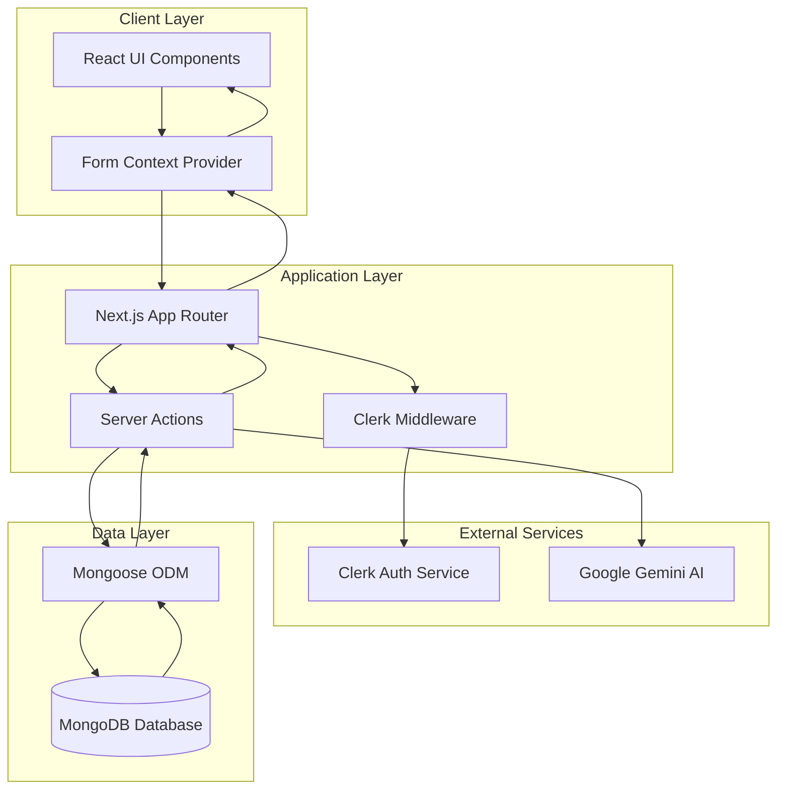

### Request-Response Cycle

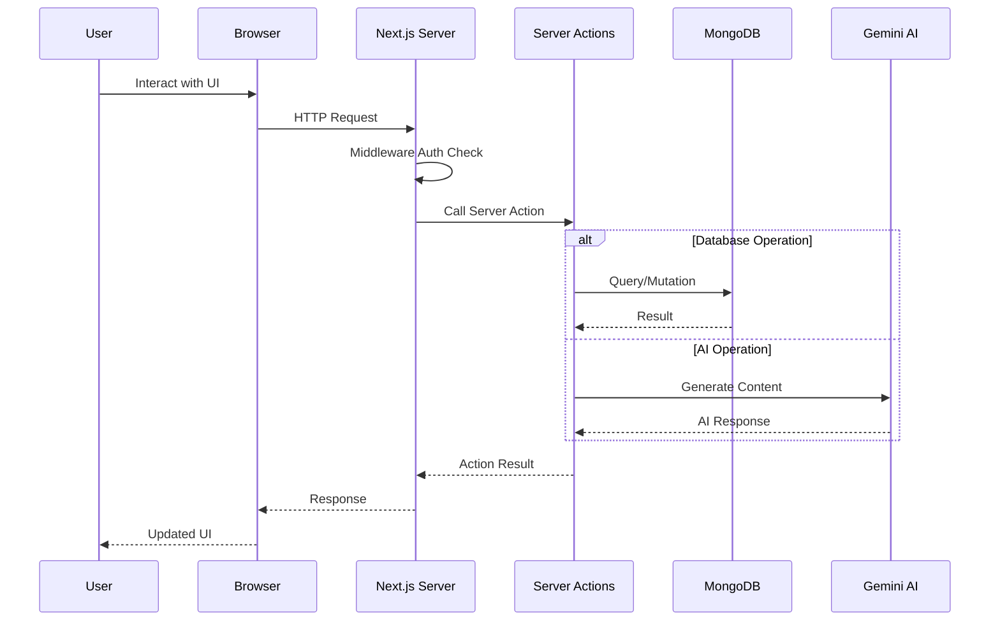

---

## 2. User Authentication Flow

### Sign-Up Flow

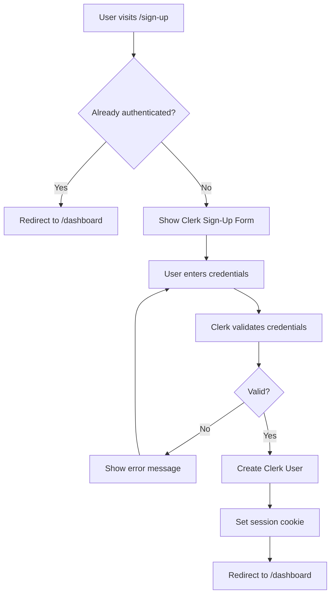

### Sign-In Flow

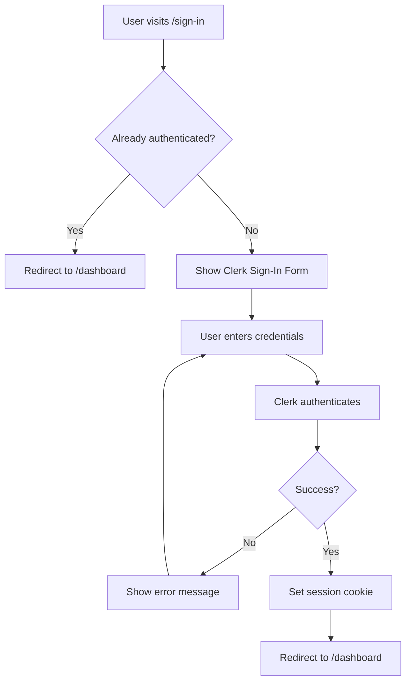

### Route Protection Flow

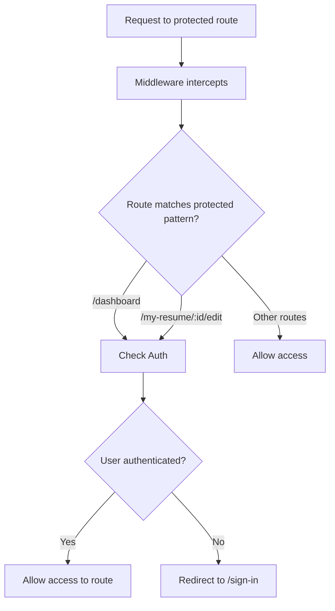

---

## 3. Resume Creation Flow

### Create New Resume

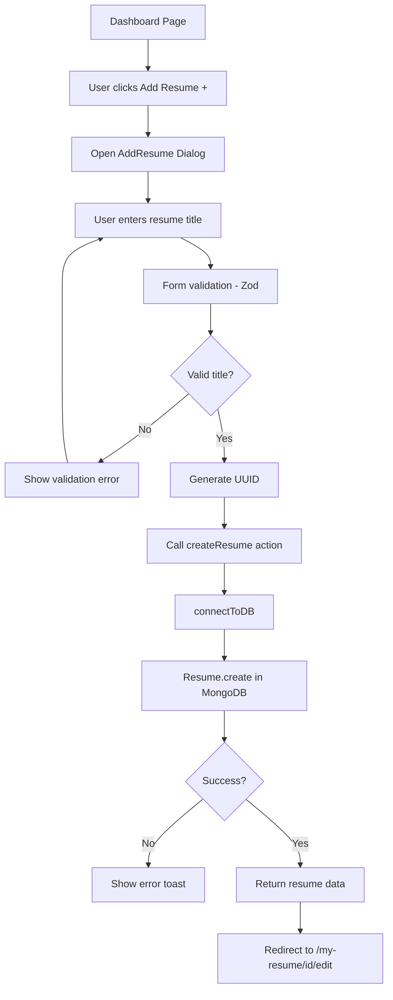

### Server Action: createResume

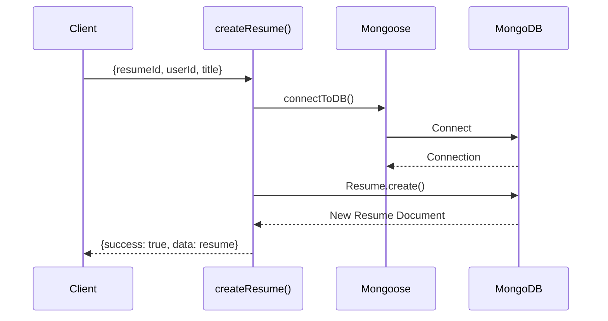

---

## 4. Resume Editing Flow

### Overall Edit Flow

```mermaid
flowchart TD
    A[/my-resume/id/edit] --> B[FormProvider loads]
    B --> C[fetchResume action]
    C --> D[Populate experience, education, skills]
    D --> E[Set formData state]
    E --> F[Render ResumeEditForm]
    F --> G{Current step?}
    G -->|1| H[PersonalDetailsForm]
    G -->|2| I[SummaryForm]
    G -->|3| J[ExperienceForm]
    G -->|4| K[EducationForm]
    G -->|5| L[SkillsForm]
    G -->|6| M[SectionOrderBoard]
    
    H --> N[User edits fields]
    I --> N
    J --> N
    K --> N
    L --> N
    M --> N
    
    N --> O[handleInputChange updates context]
    O --> P[ResumePreview re-renders]
```

### Form Step Navigation

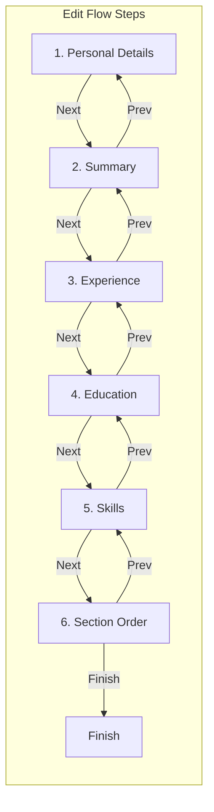

### Finish & Save Flow

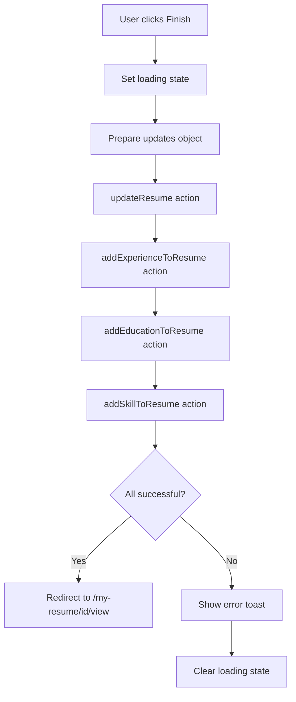

### Experience Save Flow

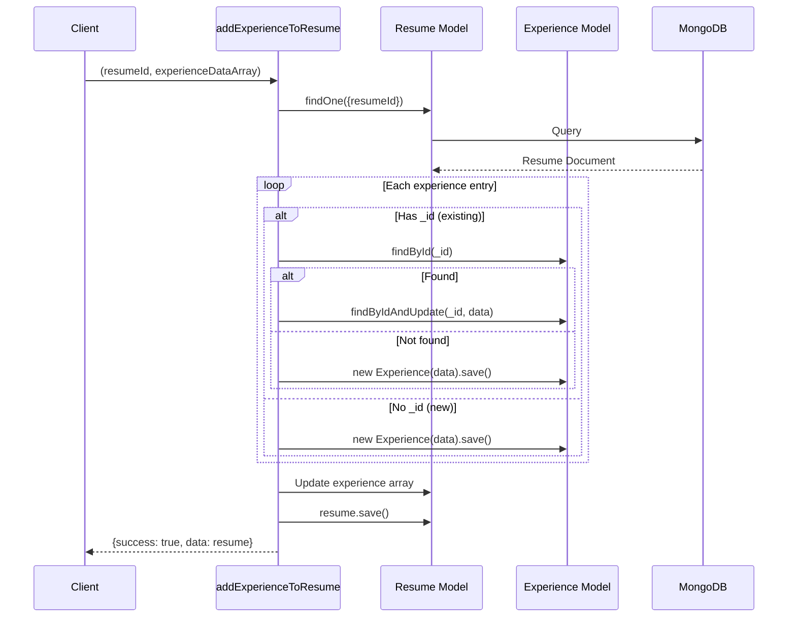

---

## 5. AI Content Generation Flow

### Summary Generation

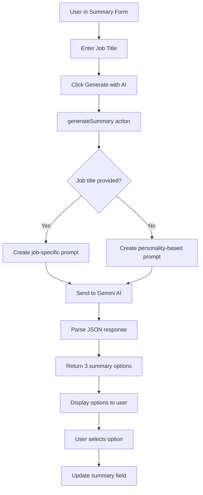

### AI Request Processing

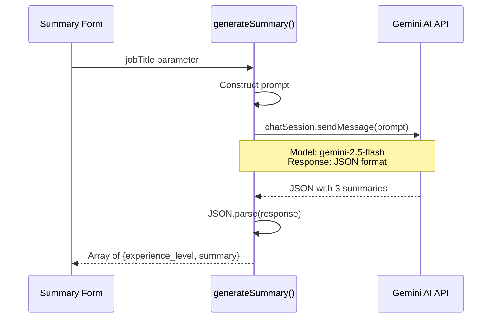

### Experience Description Generation

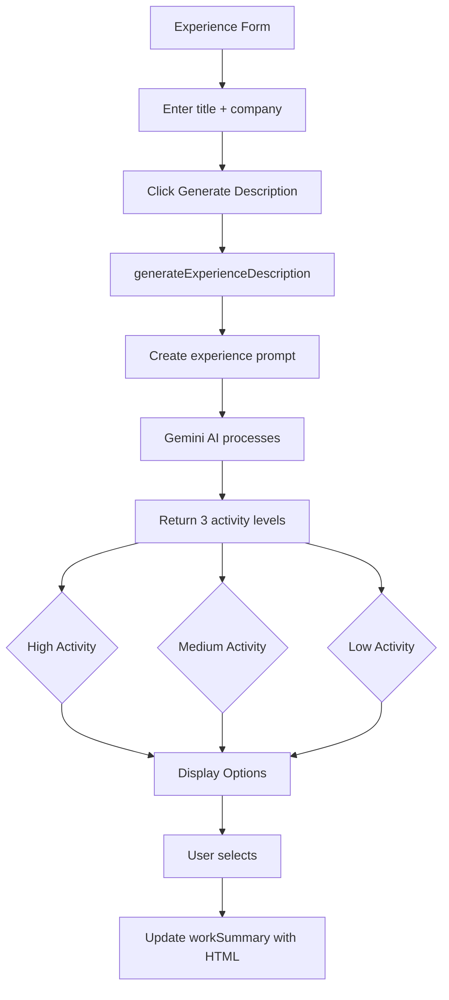

---

## 6. Resume View & Export Flow

### Resume View Flow

```mermaid
flowchart TD
    A[/my-resume/id/view] --> B[FormProvider initializes]
    B --> C[fetchResume action]
    C --> D[Load with populated data]
    D --> E{Is owner view?}
    E -->|Yes| F[Show full header + actions]
    E -->|No| G[Show preview header]
    F --> H[Render ResumePreview]
    G --> H
    H --> I[Get current template]
    I --> J{Template type?}
    J -->|classic| K[ClassicTemplate]
    J -->|modern| L[ModernTemplate]
    J -->|minimal| M[MinimalTemplate]
```

### PDF Export Flow

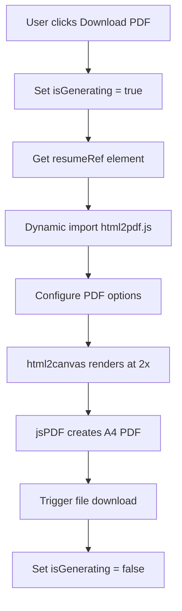

### PDF Generation Details

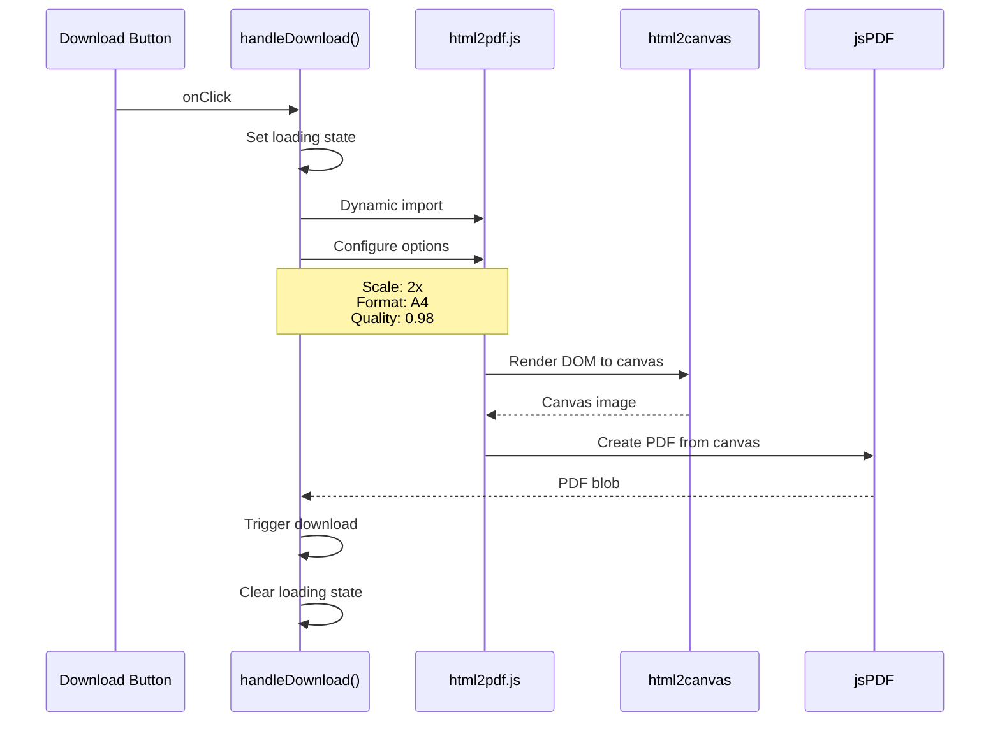

### Share URL Flow

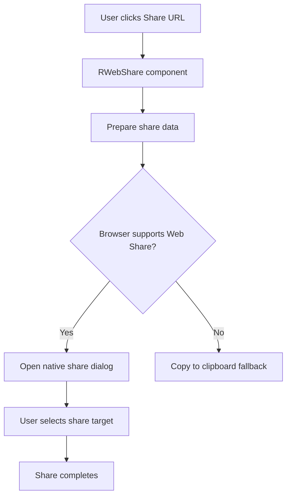

---

## 7. Resume Deletion Flow

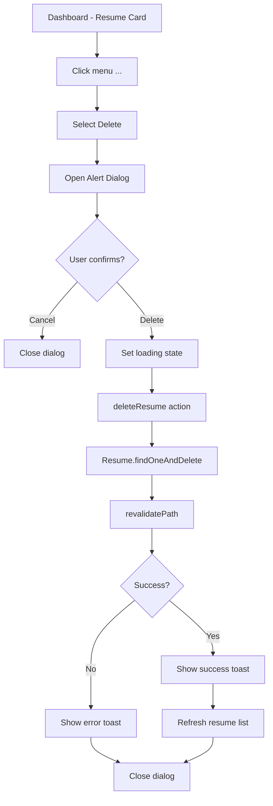

### Delete Server Action

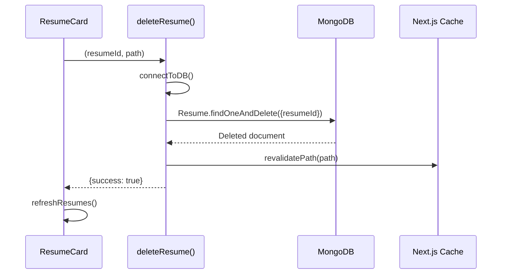

---

## 8. Data Layer Architecture

### Database Connection Flow

```mermaid
flowchart TD
    A[Server Action called] --> B[connectToDB]
    B --> C{NEXT_MONGODB_URL exists?}
    C -->|No| D[Log error, return]
    C -->|Yes| E{Already connected?}
    E -->|Yes| F[Return existing connection]
    E -->|No| G[mongoose.connect]
    G --> H[Set isConnected = true]
    H --> I[Log success]
    I --> F
```

### Data Relationship Flow

```mermaid
graph LR
    subgraph Resume Document
        R[Resume]
    end
    
    subgraph Related Documents
        E1[Experience 1]
        E2[Experience 2]
        ED1[Education 1]
        S1[Skill Category 1]
        S2[Skill Category 2]
    end
    
    R -->|experience[]| E1
    R -->|experience[]| E2
    R -->|education[]| ED1
    R -->|skills[]| S1
    R -->|skills[]| S2
```

### Populate Flow

```mermaid
sequenceDiagram
    participant Action as fetchResume()
    participant Resume as Resume Model
    participant Exp as Experience Model
    participant Edu as Education Model
    participant Skill as Skill Model
    participant DB as MongoDB
    
    Action->>Resume: findOne({resumeId})
    Resume->>DB: Query resume
    DB-->>Resume: Resume with ObjectId refs
    Resume->>Exp: populate("experience")
    Resume->>Edu: populate("education")
    Resume->>Skill: populate("skills")
    Exp->>DB: Query experiences
    Edu->>DB: Query education
    Skill->>DB: Query skills
    DB-->>Action: Fully populated resume
```

---

## 9. Component Data Flow

### Form Context Data Flow

```mermaid
graph TD
    subgraph FormProvider
        FP[FormProvider Component]
        FD[formData State]
        HI[handleInputChange]
    end
    
    subgraph Form Components
        PD[PersonalDetailsForm]
        SF[SummaryForm]
        EF[ExperienceForm]
        ED[EducationForm]
        SK[SkillsForm]
        SO[SectionOrderBoard]
    end
    
    subgraph Preview Components
        RP[ResumePreview]
        TP[Template Component]
    end
    
    FP --> FD
    FP --> HI
    
    PD -- "reads" --> FD
    SF -- "reads" --> FD
    EF -- "reads" --> FD
    ED -- "reads" --> FD
    SK -- "reads" --> FD
    SO -- "reads" --> FD
    
    PD -- "calls" --> HI
    SF -- "calls" --> HI
    EF -- "calls" --> HI
    ED -- "calls" --> HI
    SK -- "calls" --> HI
    SO -- "calls" --> HI
    
    HI -- "updates" --> FD
    FD -- "triggers re-render" --> RP
    RP --> TP
```

### Template Rendering Flow

```mermaid
flowchart TD
    A[ResumePreview] --> B[useFormContext]
    B --> C[Get formData.template]
    C --> D{Template type?}
    D -->|classic| E[ClassicTemplate]
    D -->|modern| F[ModernTemplate]
    D -->|minimal| G[MinimalTemplate]
    
    E --> H[Map sectionOrder]
    F --> H
    G --> H
    
    H --> I{Section key?}
    I -->|summary| J[Render Summary]
    I -->|experience| K[Render Experiences]
    I -->|education| L[Render Education]
    I -->|skills| M[Render Skills]
```

---

## 10. State Management Flow

### Form State Update Flow

```mermaid
flowchart TD
    A[User types in input] --> B[onChange event]
    B --> C[handleInputChange]
    C --> D{Value type?}
    D -->|Array| E[Direct array assignment]
    D -->|Object| F[Merge with existing object]
    D -->|Primitive| G[Direct value assignment]
    E --> H[setFormData]
    F --> H
    G --> H
    H --> I[React re-render]
    I --> J[Preview updates]
```

### Loading State Flow

```mermaid
stateDiagram-v2
    [*] --> Idle
    Idle --> Loading: User action
    Loading --> Success: Operation complete
    Loading --> Error: Operation failed
    Success --> Idle: Reset
    Error --> Idle: Dismiss
    
    state Loading {
        [*] --> ShowSpinner
        ShowSpinner --> DisableButtons
    }
    
    state Success {
        [*] --> ShowToast
        ShowToast --> Redirect
    }
    
    state Error {
        [*] --> ShowErrorToast
    }
```

### Section Order State Flow

```mermaid
flowchart TD
    A[SectionOrderBoard loads] --> B[Get sectionOrder from formData]
    B --> C[Initialize DnD state]
    C --> D[User drags section]
    D --> E[onDragEnd callback]
    E --> F[Reorder array]
    F --> G[handleInputChange with new order]
    G --> H[Update formData.sectionOrder]
    H --> I[Preview re-renders with new order]
```

---

## Summary

This document illustrates the complete data flow throughout the ApnaResume application:

1. **Authentication Flow**: Clerk-managed auth with middleware protection
2. **CRUD Operations**: Server actions with MongoDB via Mongoose
3. **AI Integration**: Gemini API for content generation
4. **State Management**: React Context for form data
5. **Export**: Client-side PDF generation with html2pdf.js

Each flow is designed to provide:
- Clear separation of concerns
- Optimistic UI updates where applicable
- Proper error handling and user feedback
- Efficient data loading with population
