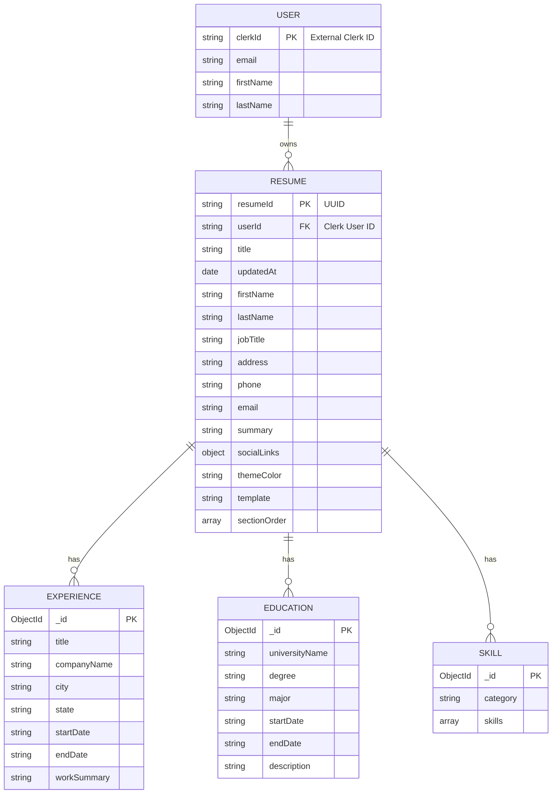
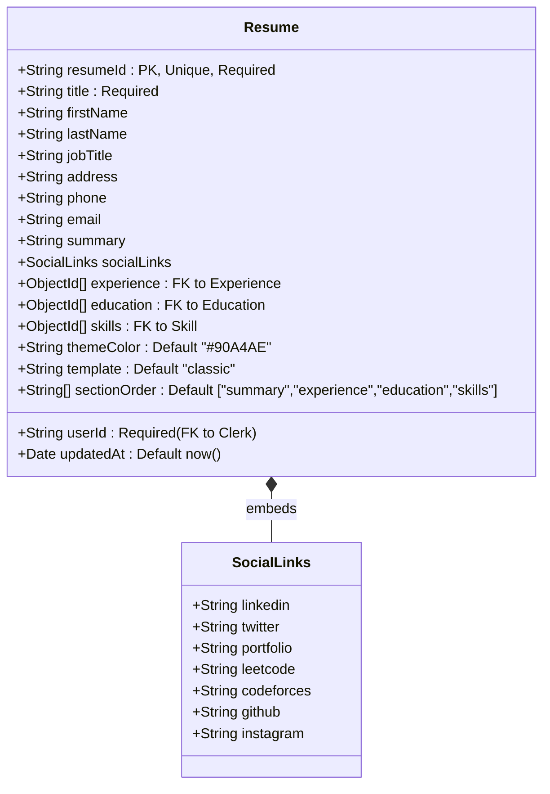
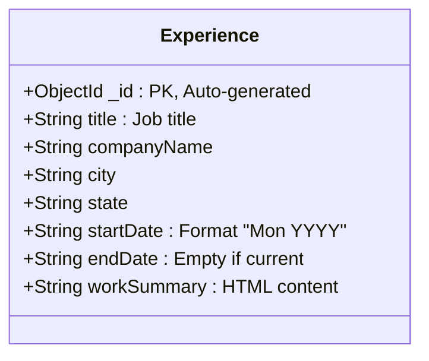
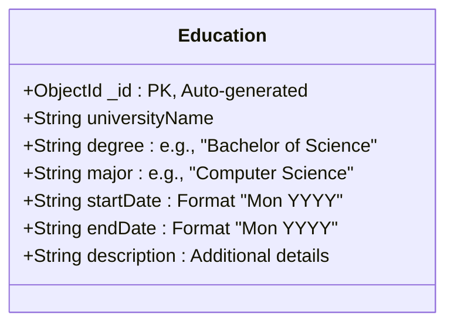
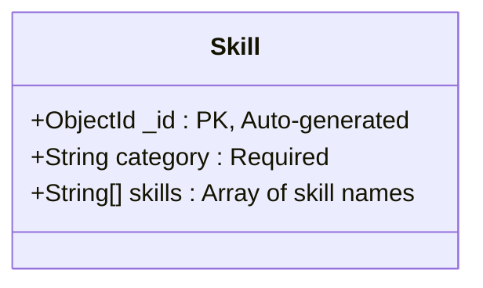
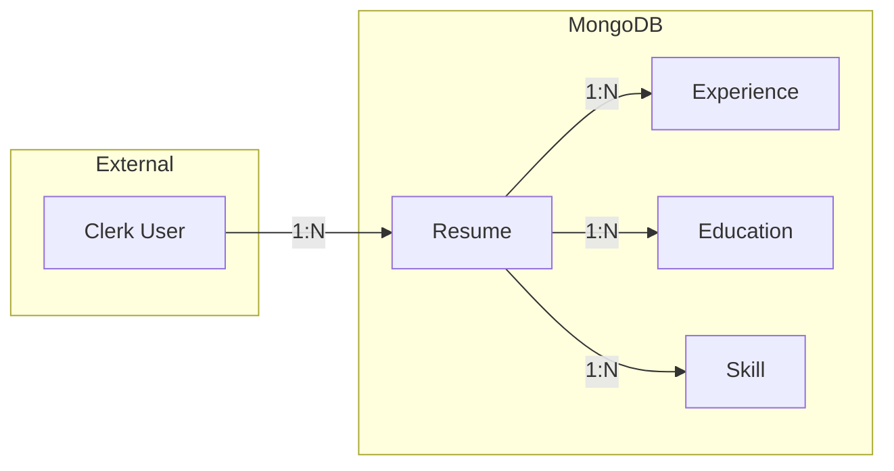
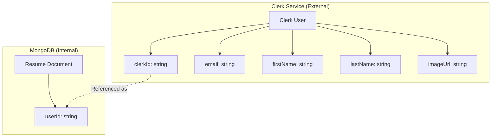
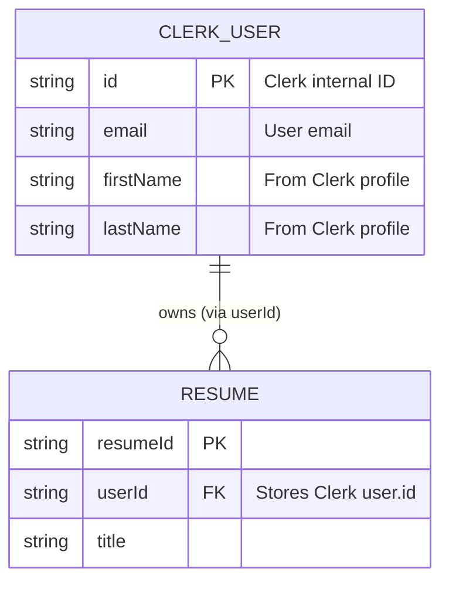
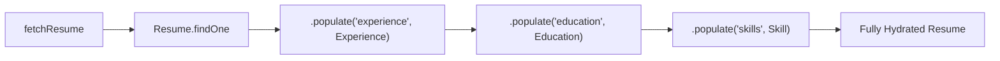

# ApnaResume - Entity Relationship Diagrams

## Table of Contents
1. [Overview](#overview)
2. [Core Entity Relationships](#core-entity-relationships)
3. [Detailed Entity Schemas](#detailed-entity-schemas)
4. [Relationship Cardinality](#relationship-cardinality)
5. [Entity Attributes](#entity-attributes)
6. [Clerk User Integration](#clerk-user-integration)
7. [Data Integrity Rules](#data-integrity-rules)

---

## Overview

The ApnaResume application uses MongoDB as its database with Mongoose as the ODM (Object Document Mapper). The data model consists of four main entities with document references for related data.

### Entity Summary

| Entity | Collection | Purpose |
|--------|------------|---------|
| Resume | `resumes` | Main document storing resume metadata and personal info |
| Experience | `experiences` | Work experience entries |
| Education | `educations` | Educational background entries |
| Skill | `skills` | Skill categories with skills list |

---

## Core Entity Relationships

### High-Level ER Diagram



---

## Detailed Entity Schemas

### Resume Entity (Main Document)



### Experience Entity



### Education Entity



### Skill Entity



---

## Relationship Cardinality

### Relationship Diagram with Cardinality



### Cardinality Table

| Parent | Child | Relationship | Cardinality |
|--------|-------|--------------|-------------|
| Clerk User | Resume | User owns Resumes | 1:N (One-to-Many) |
| Resume | Experience | Resume has Experiences | 1:N (One-to-Many, 0..N) |
| Resume | Education | Resume has Education | 1:N (One-to-Many, 0..N) |
| Resume | Skill | Resume has Skills | 1:N (One-to-Many, 0..N) |

### Reference Type
- **Resume → Experience**: Array of ObjectId references
- **Resume → Education**: Array of ObjectId references
- **Resume → Skill**: Array of ObjectId references

---

## Entity Attributes

### Resume Document - Complete Schema

```
Resume
├── resumeId (String)
│   ├── Type: String
│   ├── Required: true
│   ├── Unique: true
│   └── Description: UUID v4 identifier
│
├── userId (String)
│   ├── Type: String
│   ├── Required: true
│   ├── Indexed: true (implied)
│   └── Description: Clerk user ID (foreign key)
│
├── title (String)
│   ├── Type: String
│   ├── Required: true
│   └── Description: Resume display name
│
├── updatedAt (Date)
│   ├── Type: Date
│   ├── Default: Date.now
│   └── Description: Last modification timestamp
│
├── Personal Information
│   ├── firstName (String)
│   ├── lastName (String)
│   ├── jobTitle (String)
│   ├── address (String)
│   ├── phone (String)
│   ├── email (String)
│   └── summary (String)
│
├── socialLinks (Object)
│   ├── linkedin (String)
│   ├── twitter (String)
│   ├── portfolio (String)
│   ├── leetcode (String)
│   ├── codeforces (String)
│   ├── github (String)
│   └── instagram (String)
│
├── experience (Array<ObjectId>)
│   ├── Type: [mongoose.Schema.Types.ObjectId]
│   ├── Ref: "Experience"
│   └── Description: References to Experience documents
│
├── education (Array<ObjectId>)
│   ├── Type: [mongoose.Schema.Types.ObjectId]
│   ├── Ref: "Education"
│   └── Description: References to Education documents
│
├── skills (Array<ObjectId>)
│   ├── Type: [mongoose.Schema.Types.ObjectId]
│   ├── Ref: "Skill"
│   └── Description: References to Skill documents
│
├── themeColor (String)
│   ├── Type: String
│   ├── Default: "#90A4AE"
│   └── Description: Hex color code for resume theme
│
├── template (String)
│   ├── Type: String
│   ├── Default: "classic"
│   ├── Allowed: ["classic", "modern", "minimal"]
│   └── Description: Resume template type
│
└── sectionOrder (Array<String>)
    ├── Type: [String]
    ├── Default: ["summary", "experience", "education", "skills"]
    └── Description: Order of resume sections
```

### Experience Document - Complete Schema

```
Experience
├── _id (ObjectId)
│   ├── Type: mongoose.Schema.Types.ObjectId
│   ├── Auto-generated: true
│   └── Description: MongoDB document ID
│
├── title (String)
│   ├── Type: String
│   └── Description: Job title/position
│
├── companyName (String)
│   ├── Type: String
│   └── Description: Employer name
│
├── city (String)
│   ├── Type: String
│   └── Description: Work location city
│
├── state (String)
│   ├── Type: String
│   └── Description: Work location state/province
│
├── startDate (String)
│   ├── Type: String
│   ├── Format: "Mon YYYY" (e.g., "Jan 2022")
│   └── Description: Employment start date
│
├── endDate (String)
│   ├── Type: String
│   ├── Format: "Mon YYYY" or empty for current
│   └── Description: Employment end date
│
└── workSummary (String)
    ├── Type: String
    ├── Format: HTML content
    └── Description: Job responsibilities and achievements
```

### Education Document - Complete Schema

```
Education
├── _id (ObjectId)
│   ├── Type: mongoose.Schema.Types.ObjectId
│   └── Auto-generated: true
│
├── universityName (String)
│   ├── Type: String
│   └── Description: Institution name
│
├── degree (String)
│   ├── Type: String
│   └── Description: Degree type (e.g., "Bachelor of Science")
│
├── major (String)
│   ├── Type: String
│   └── Description: Field of study
│
├── startDate (String)
│   ├── Type: String
│   └── Description: Start date
│
├── endDate (String)
│   ├── Type: String
│   └── Description: Graduation date
│
└── description (String)
    ├── Type: String
    └── Description: Additional details about education
```

### Skill Document - Complete Schema

```
Skill
├── _id (ObjectId)
│   ├── Type: mongoose.Schema.Types.ObjectId
│   └── Auto-generated: true
│
├── category (String)
│   ├── Type: String
│   ├── Required: true
│   └── Description: Skill category name (e.g., "Languages")
│
└── skills (Array<String>)
    ├── Type: [String]
    └── Description: List of skills in this category
```

---

## Clerk User Integration

### External User Entity

The application uses Clerk for authentication, which means user data is managed externally.



### User-Resume Relationship



---

## Data Integrity Rules

### Constraints and Validations

| Entity | Field | Constraint | Validation |
|--------|-------|------------|------------|
| Resume | resumeId | Unique | UUID v4 format |
| Resume | userId | Required | Must exist in Clerk |
| Resume | title | Required | Min 3 characters (Zod) |
| Resume | template | Enum | "classic" \| "modern" \| "minimal" |
| Resume | themeColor | Format | Hex color code |
| Resume | sectionOrder | Array | Valid section keys only |
| Skill | category | Required | Not empty string |

### Reference Integrity

```mermaid
flowchart TD
    A[Resume Document] --> B{References valid?}
    B -->|experience[]| C[Check Experience._id exists]
    B -->|education[]| D[Check Education._id exists]
    B -->|skills[]| E[Check Skill._id exists]
    
    C --> F{All exist?}
    D --> F
    E --> F
    
    F -->|Yes| G[Population successful]
    F -->|No| H[Return null for missing refs]
```

### Cascade Behavior

| Operation | Parent | Child Documents |
|-----------|--------|-----------------|
| Delete Resume | Resume deleted | Child references orphaned* |
| Update Experience | Experience updated | Resume ref unchanged |
| Delete Experience | Experience deleted | Resume ref becomes invalid* |

> **Note**: The application does not implement automatic cascade deletes. Orphaned references may exist in the database.

### Data Population Strategy



---

## Database Indexes

### Recommended Indexes

```javascript
// Resume collection
db.resumes.createIndex({ resumeId: 1 }, { unique: true })
db.resumes.createIndex({ userId: 1 })

// For faster user-specific queries
db.resumes.createIndex({ userId: 1, updatedAt: -1 })
```

### Query Patterns

| Query | Index Used | Purpose |
|-------|------------|---------|
| `findOne({ resumeId })` | resumeId_1 | Fetch single resume |
| `find({ userId })` | userId_1 | Fetch user's resumes |
| `find({ userId }).sort({ updatedAt: -1 })` | userId_1_updatedAt_-1 | Dashboard listing |

---

## Summary

The ApnaResume data model follows a **document-reference pattern** where:

1. **Resume** is the central entity containing user's resume metadata and personal information
2. **Experience**, **Education**, and **Skill** are separate collections referenced by ObjectId arrays
3. **Clerk** manages user authentication externally, with `userId` stored in Resume documents
4. **Embedded Object** (`socialLinks`) is used for tightly coupled data
5. **References** are used for collections that may be reused or have variable length

This design allows for:
- Efficient querying of resume lists without loading all related data
- Flexible updates to individual sections
- Easy population of full resume data when needed
- Separation of concerns between resume metadata and content sections
